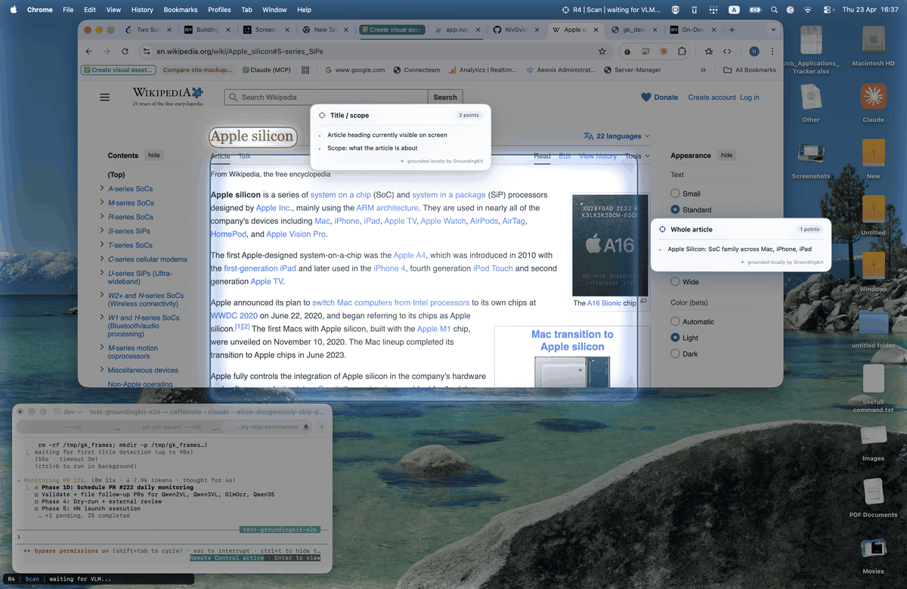

# GroundingKit



**GroundingKit is a macOS overlay that reads what's on your own screen — so you can annotate, summarize, or map long documents. All local on Apple Silicon. No cloud. No meetings, no interviews, no hidden assistance.**

It's the "pointing" layer of screen automation — one level below *"describe the screen"* (captioning / Q&A) and one level above *"control the mouse"* (raw input injection). GroundingKit renders actionable visual signals **on** the screen, keyed to what's actually there.

[][writeup] [][upstream-pr] [](LICENSE)

---

## What it isn't

GroundingKit is **not** an AI assistant for meetings, interviews, or sales calls. It does not capture audio. It does not run in the background. The menu-bar icon is visible at all times. GroundingKit reads only your own visible screen, when you open the overlay, entirely on-device. The engine has no network code path — the only optional network call is an initial model download from Hugging Face, cached locally thereafter.

## What it does

- Detects content regions (article body, sidebars, figures, headers) from a full-screen capture via Qwen2.5-VL — on-device.
- Runs Apple Vision OCR inside those regions with scroll-accumulation (stitches text across multiple scroll positions via fuzzy matching).
- Renders an overlay with guide markers — annotations, summary cards, corner-anchor lines — aligned to content coordinates.
- Exposes its "understanding" as files in `/tmp/` so downstream tooling (or a human) can read it.

Built as a **library + reference app**: the engine is the product, the menu-bar app demonstrates one use.

---

## Architecture

```
┌─────────────────────────────────────────────────────────────────────────┐
│  GroundingKit                                                            │
│  ────────────────────────────────────────────────────────────            │
│                                                                          │
│  ScreenCapture ──► NativePanelDetector ──► DeepScan OCR                  │
│   (CGWindowList)    (Qwen2.5-VL via MLX)    (Apple Vision)               │
│                                │                    │                    │
│                                ▼                    ▼                    │
│                        ScrollAccumulator ◄──► ContentState               │
│                          (text stitching)    (reader/document state)     │
│                                                     │                    │
│                                                     ▼                    │
│                                           OverlayController              │
│                                         (guide markers on screen)        │
└──────────────────────────────────────────────────────────────────────────┘
```

---

## Quick start

### Requirements

- macOS 14 or later, **Apple Silicon** (M1/M2/M3/M4)
- Xcode 16+ (Xcode 26 recommended — tested configuration)
- ~6 GB disk for the Qwen2.5-VL-7B-4bit model weights (auto-downloaded on first run)
- ~8 GB free RAM during inference

### Build & run

```bash
git clone https://github.com/NivDvir/screen-overlay-toolkit.git
cd screen-overlay-toolkit
bash build-app.sh
open GroundingKit.app
```

On first launch macOS will prompt for:

- **Screen Recording** (System Settings → Privacy & Security → Screen Recording → add `GroundingKit.app`)
- **Accessibility** (System Settings → Privacy & Security → Accessibility → add `GroundingKit.app`) — only used for auto-scroll when you enable reader mode

Once permissions are granted, open a long article in Chrome (Wikipedia, arXiv, a blog post). GroundingKit detects the content region and the overlay appears with detected panel outlines.

### Reader mode

```bash
GK_FORCE_READER=1 open GroundingKit.app
```

Reader mode skips two-panel detection and treats the frontmost Chrome window as a single document panel. Intended for Wikipedia, arXiv, release notes, and long-form reading.

### Use as a Swift library

The grounding capability is exposed as a separate library target — you can `import GroundingKit` from any Swift Package without pulling in the menu-bar app shell:

```swift
// Package.swift
.package(url: "https://github.com/NivDvir/screen-overlay-toolkit", branch: "main"),

// Your code
import GroundingKit
import CoreGraphics

let grounder = try await Grounder()
let regions = try await grounder.ground(
    image: cgImage,
    prompt: """
    Detect these two UI panels and output their bbox_2d coordinates as a JSON array:
    1. "question" - the problem description panel on the left
    2. "editor" - the code editor panel on the right
    """
)
// regions: [BoundingBox(question: [1, 146, 421, 626]), BoundingBox(editor: [421, 146, 881, 626])]
```

`Grounder.ground(image:prompt:)` accepts free-form prompts. The model weights must be pre-downloaded to `~/.cache/huggingface/hub/`; set `GK_MODEL` to swap models (any Qwen2.5-VL-architecture derivative works — UI-TARS-1.5-7B is verified). Returned coordinates are in the model's resize space (max 1280 px on the longest side).

---

## Under the hood — native Swift Qwen2.5-VL

GroundingKit runs Qwen2.5-VL-7B-Instruct-4bit natively on Apple Silicon via [MLX](https://github.com/ml-explore/mlx). **Zero Python in the inference path.**

Getting there required fixing 7 bugs in `mlx-swift-lm`'s Qwen2.5-VL implementation — ranging from a silently-dropped attention mask in the vision encoder to MROPE section layout, `rope_deltas` not applied during autoregressive generation, and training-distribution mismatches in image resizing. Plus a PIL-matching Lanczos preprocessing path (Core Image's Lanczos diverges from Pillow on high-frequency content enough to shift bboxes by tens of pixels). After the fixes, Swift output matches the Python `mlx-vlm` reference at ≤ 2 px on all bbox edges — 6 of 8 bit-exact on a 2-panel test image. See [PR #222][upstream-pr] for the bug-by-bug breakdown and the parity reproducer.

### A note on performance

Native Swift doesn't make the model run faster. The VLM forward pass is the same Metal kernels in either language, and a one-shot `mlx-vlm` Python benchmark finishes within a few percent of the Swift equivalent. What Swift changes is everything *around* the model:

- **Cold start ~3 s vs ~15 s** — no interpreter, no PyTorch import, just mmap the weights.
- **Zero-IPC pipeline** — `CGWindowListCreateImage` → VLM → `VNRecognizeTextRequest` → Metal overlay all run in one process with shared memory. A Python pipeline has to serialize each screenshot across the subprocess boundary, adding 30–100 ms per cycle on top of inference.
- **Real-time frame work becomes viable** — a per-frame 16 ms budget has room for actual OCR and overlay redraw; it doesn't fit a round-trip to a Python worker.
- **Bounded memory over long sessions** — `autoreleasepool` around CGImage ops keeps a 100-minute session at ~5.5 GB peak; an equivalent Python subprocess path leaks ~900 MB over the same duration through PyObjC bridging.

The headline inference number is the same either way. The difference is whether you can wrap that around a responsive app.

The fixes live on a fork of `mlx-swift-lm` pinned via `Package.swift`:

- **Fork branch:** https://github.com/NivDvir/mlx-swift-lm/tree/fix/qwen25vl-mrope
- **Upstream PR:** [ml-explore/mlx-swift-lm#222][upstream-pr]
- **Full investigation writeup:** [*Building a Real-Time Screen Reader on macOS That Actually Works*][writeup]

The same combined patch has also been validated on UI-TARS-1.5-7B (same `Qwen2_5_VLForConditionalGeneration` architecture) — two independent models, same patched path. See the PR for the A/B reproducer.

If `#222` gets merged upstream, `Package.swift` will be repointed to `ml-explore/mlx-swift-lm` and the fork retired. Until then, the fork is the ground truth for working Qwen2.5-VL-in-Swift.

---

## File layout

Organized by **feature**, not by layer. Each folder under `Sources/GroundingKit/Features/` is self-contained — copy just that folder into another project to reuse the capability.

```
screen-overlay-toolkit/
├── README.md                 # this file
├── BUILD_NOTES.md            # mlx-swift-lm fork dependency notes
├── Package.swift             # SPM config (points at NivDvir/mlx-swift-lm fork)
├── Info.plist                # .app bundle metadata template
├── build-app.sh              # builds GroundingKit.app
├── Sources/
│   ├── GroundingKit/Features/       # ← library code, feature-organized
│   │   ├── WindowCapture/           # find + capture browser windows (+ README)
│   │   ├── PanelDetection/          # Qwen2.5-VL grounding (+ README)
│   │   ├── OCRScrollAccumulator/    # Vision OCR + scroll-stitching (+ README)
│   │   ├── GuidanceOverlay/         # draw markers on screen (+ README)
│   │   ├── ChangeDetection/         # pixel-diff change detection (+ README)
│   │   └── Engine/                  # orchestrator + shared state (+ README)
│   └── GroundingKitApp/             # the shipped macOS app = reference consumer
│       ├── main.swift
│       └── AppDelegate.swift
├── Samples/                         # standalone seed code per feature
│   ├── MinimalPanelDetection.swift
│   ├── ScrollReader.swift
│   ├── ScreenAnnotator.swift
│   └── DiffWatcher.swift
├── Python/                          # optional Python backends (panel_detector*.py)
└── patches/                         # MROPE patch (backup — fork already applies it)
```

Each `Sources/GroundingKit/Features/<Name>/README.md` documents:

- what the feature does
- standalone usage code
- exact cross-feature dependencies
- public API surface

The `Samples/*.swift` files are copy-paste seeds for other projects — minimal real-world wirings using just one feature.

---

## Adapting to a specific site

Out of the box, GroundingKit works on any Chrome window with no filters. To target a specific site with custom detection rules (sidebar labels to ignore, UI keywords to filter, layout hints), add a case to `PlatformConfig.swift`:

```swift
static let wikipedia = PlatformConfig(
    name: "Wikipedia",
    browserWindowKeywords: ["Wikipedia"],
    sidebarLabels: ["main page", "contents", "languages"],
    uiKeywords: ["Edit", "View history", "Search"],
    editorThemeIsDark: false,
    layoutMode: .reader
)
```

Then extend `PlatformConfig.detect()` to return `.wikipedia` when the Chrome window title matches.

---

## License

MIT — see [LICENSE](LICENSE).

---

## Credits

- **Qwen2.5-VL** — Alibaba, used via [MLX](https://github.com/ml-explore/mlx) and [mlx-swift-lm](https://github.com/ml-explore/mlx-swift-lm) (with [fork patches](https://github.com/NivDvir/mlx-swift-lm/tree/fix/qwen25vl-mrope) applied).
- **Apple Vision / MLX / Metal** — Apple.
- **Python reference** — [`mlx-vlm`](https://github.com/Blaizzy/mlx-vlm) by Blaizzy Pe.

[writeup]: https://dev.to/nivdvir/building-a-real-time-screen-reader-on-macos-that-actually-works-471
[upstream-pr]: https://github.com/ml-explore/mlx-swift-lm/pull/222
